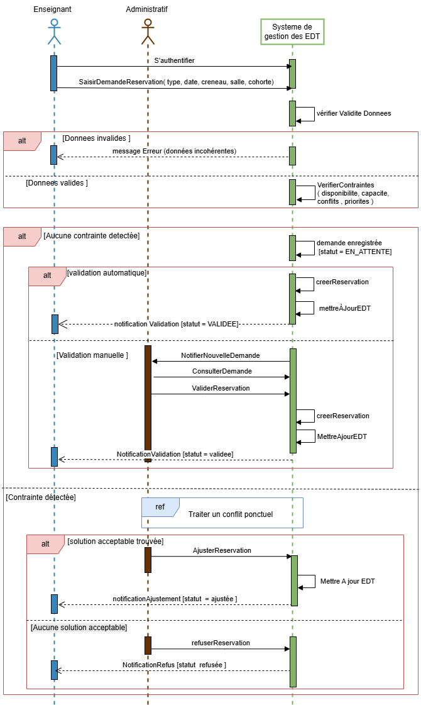

# Diagrammes de séquence

Ce dossier contient les diagrammes de séquence du projet.

**Liste des processus modélisés :**

1. **Consulter l'emploi du temps** : Visualisation du planning avec filtres.

2. **Demande de réservation** : Soumission par l'enseignant, analyse des contraintes et validation.

3. **Traiter un conflit ponctuel** : Résolution des conflits détectés.

4. **Modifier un emploi du temps** : Ajustement des réservations existantes.
